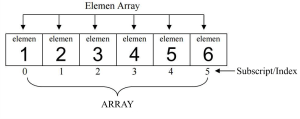
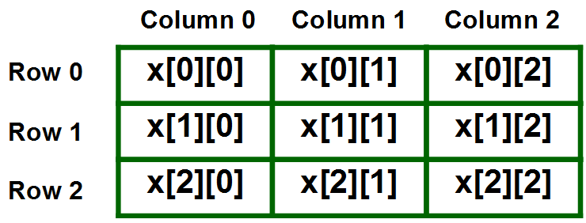
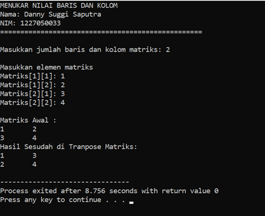
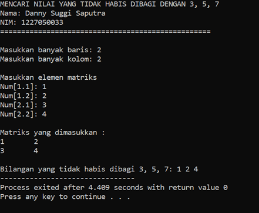

# Pengenalan Array pada Bahasa C++

## Ditulis oleh

<div align='center'>


<br> Danny Suggi Saputra - 1227050033

<br> [Teknik Informatika](http://if.uinsgd.ac.id/) - [UIN Sunan Gunung Djati Bandung](https://uinsgd.ac.id/) 

</div>

# Array

Array atau Larik adalah sebuah **variable** yang memiliki serangkaian elemen dari jenis **tipe data yang sama**. Elemen-elemen tersebut dirangkai di dalam memori yang berdekatan dengan elemen lainnya. Bayangkan apabila pekerja sedang bekerja membuat program untuk suatu organisasi sekolah, tepatnya digunakan untuk mendata nilai-nilai dari siswa pada suatu kelas, dan dalam satu kelas terdapat 50 anak. Dengan arti kita membutuhkan 50 tempat penyimpanan (variabel).

```cpp
Double nilai1, nilai2, nilai3, …, nilai50;
```

Jika menggunakan logika diatas akan sangat tidak efektif atau salah. Bagaimana jika satu kelas tidak selalu memiliki 50 anak, mungkin di masa depan akan memiliki murid lebih dari 50 anak di dalam kelas. Dengan arti program itu akan selalu membutuhkan modifikasi, bukan hanya pada variabel tersebut tapi keseluruhan program, seperti input, proses dan output. Untungnya, dalam bahasa pemrograman C++ dan hampir semua bahasa pemrograman, menyediakan fitur yang bernama “Array” atau “Larik”.

**Array** memungkinkan kita untuk membuat sebuah **variabel yang dapat menyimpan banyak nilai**. Di dalam array terdapat banyak elemen yang merupakan tempat untuk penyimpanan setiap nilai.

1. Bentuk Penulisan <br>
   Untuk merubah variabel biasanya menjadi variabel array adalah dengan **menambahkan operator subscript ( [ ] )**. Untuk parameter di dalam operator subscript disebut sebagai `index` atau `subscript`, tempat dimana kita memberitahukan compiler berapa jumlah variabel yang akan di alokasi sesuai yang kita inginkan. dan dalam array, istilah dari banyak variabel yang dialokasi itu disebut sebagai elemen. <br>Contoh penulisan: <br>
   ```cpp
   tipeData identifier[ukuran];
   ```

2. Inisialisasi Array <br>
   Saat mendirikan variabel array kita juga dimungkinkan untuk memberi nilai saat deklarasi variabel array secara bersamaan, **inisialisasi array** disebut sebagai `Initializer list`. Apa yang kita butuhkan untuk inisialisasi sebuah variabel array adalah sepasang tanda kurung kurwal yang mengapit semua nilai tersebut. <br>
   Contoh penulisan: 
   ```cpp
   int grade[50] = {100, 90, 80, 70, 60, 50, 40, 30, 20, 10};
   ``` 
   Di atas adalah contoh dari cara inisialiasi sebuah variabel array yang memiliki 50 elemen. Untuk melakukan inisialisasi kita membutuhkan tanda sama dengan setelah itu nilai dari setiap elemen. Nilai-nilai setiap elemen akan di kurung di dalam sepasang tanda kurung kurawal. Setiap nilai dipisahkan dengan tanda koma.

3. Mengakses Variabel Array <br>
   Untuk mengakses variabel array tidak jauh beda dengan cara mengakses variabel biasa, untuk mengakses variabel array membutuhkan **operator subscript ( [] ) dengan index di dalamnya** yang diletakan setelah identitas variabel. <br>
   Contoh penulisan:
   ``` cpp
   grade[2];
   ```
   Contoh di atas akan mengakses elemen ketiga dari variabel `grade`.  Bahasa pemrograman C++ tepatnya pada fitur array selalu menggunakan bilangan cacah (bilangan dimulai dari 0). <br>
   
   <div align="center">
      
   </div>

# Array Multidimensi

Array adalah fitur dari bahasa pemrograman c++ yang memungkinkan kita untuk memesan banyak memori yang memiliki **tipe data yang sama** dengan hanya **menggunakan satu identitas**. Dalam variabel kita dimungkinkan untuk menggunakan **array lebih dari satu buah**, dan hal itu disebut sebagai **Array Multidimensi**.

1. Bentuk Penulisan <br>
   ```cpp
   tipeData identifier[size1][size2];
   ```
   Array dua dimensi memungkinkan anda untuk menggunakan **array di dalam array**, disetiap array memiliki array di dalamnya. Kita dapat membayangkan sebuah array dua dimensi seperti sebuah **table yang memiliki baris dan kolom**, untuk array atau subscript pertama adalah baris dan subscript kedua adalah kolom. Contoh:
   ```cpp
   Int x[3][3];
   ``` 
   <br>
   <div align="center">
      
   </div>

2. Inisialisasi Array Dua Dimensi <br>
   Untuk menginisialisasi array dua dimensi adalah dengan cara menggunakan tanda kurung kurawal di dalam tanda kurung kurawal.
   ```cpp
   string nama[3][2]={
	   {“joko”, “dadang”}, //baris ke satu dengan 2 kolom
	   {“fajar”, “nick”}, // baris ke dua dengan 2 kolom
	   {“laksono”, ”eren”} // baris ke tiga dengan 2 kolom
    }
    ```
    Tanda kurung **kurawal pertama** akan menyatakan **keseluruhan array dari variabel**, di dalamnya terdapat **3 sepasang kurung kurawal** yang dipisahkan dengan tanda koma, yang **menyatakan array dari subscript pertama**. Di dalam masing-masing tanda subscript pertama berdiri **2 nilai sesuai ukuran array subscript kedua**, masing-masing nilai dipisahkan dengan tanda koma.

3.	Mengakses Array Dua Dimensi <br> 
    Untuk **mengakses sebuah cell pada array dimensi dua**, sama seperti kita mengakses array dimensi satu. Tapi disini kita **membutuhkan dua subscript** sebagai alamat cell tersebut.
    ```cpp 
    nama[2][1];
    ```
    Untuk dapat mengakses setiap cell di dalam array dua dimensi **dengan dinamis** anda dapat menggunakan pernyataan **pengulangan nested (nested loop)**.

# Studi Kasus

Array dan multidimensional array dapat digunakan untuk berbagai kasus, salah satunya adalah pengoprasian matriks. Pada dasarnya **matriks ini sama dengan konsep dari array** itu sendiri. Matriks adalah sekumpulan bilangan yang disusun berdasarkan baris dan kolom, serta ditempatkan di dalam tanda kurung. <br>
Contoh kasus yang akan penulis kerjakan ialah: <br>

1.  Menukar nilai baris dan kolom dalam suatu matriks atau bisa disebut sebagai transpose matriks.
2.	Membuat deret bilangan pada matriks dan mencari sejumlah bilangan yang tidak habis dibagi 3, 5, 7.

Untuk source code soal nomor 1 dan 2 dapat dilihat pada folder **Studi Kasus**.

## Output Program

Soal nomor 1: <br>
<div align="center">
   
</div>

Soal nomor 2:<br>
<div align="center">
   
</div>